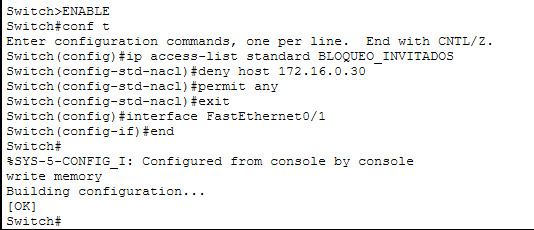

# Proyecto: Blindaje de Red en Operaciones Aduanales 🛡️⚓

## Escenario del Negocio
En el entorno de una agencia Aduanal la integridad de los datos de nóminas y pedimentos es crítca. Este proyecto demuestra la capacidad de segmentar la red para evitar que usuarios no autorizados (Invitados) accedan a servidores de alta sensibilidad

## Solución Técnica Implementada
Se diseñó una topología estrella utilizando un Switch Cisco 2960, aplicando **Listas de Control de Acceso (ACLs)** para el filtrado de paquetes de la capa 2 del modelo OSI

### Configuración de Seguridad (CLI)
Implementación técnica exacta

### Verificación de Políticas
Utilización del comando `show ip access-list` para validad la persistencia de las reglas en el equipo:
