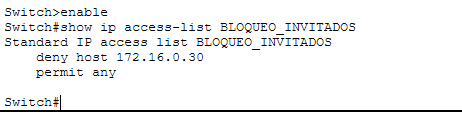

# Proyecto: Blindaje de Red en Operaciones Aduanales 🛡️⚓

## Escenario del Negocio
En el entorno de una agencia Aduanal la integridad de los datos de nóminas y pedimentos es crítca. Este proyecto demuestra la capacidad de segmentar la red para evitar que usuarios no autorizados (Invitados) accedan a servidores de alta sensibilidad

## Solución Técnica Implementada
Se diseñó una topología estrella utilizando un Switch Cisco 2960, aplicando **Listas de Control de Acceso (ACLs)** para el filtrado de paquetes de la capa 2 del modelo OSI

### Configuración de Seguridad (CLI)
A continuación se muestra el comando exacto de la denegación del servicio y el permiso para el resto de la red

### Verificación de reglas 
Para confirmar que la política se cargó correctamente en el Hardware se utilizó el comando `show ip access-list`.

## 4. Diagnóstico de Red
- **Estado:** Configuración exitosa en CLI.
- **Observación:** El simulador no reportó matches (Bug de Packet Tracer).
- **Acción:** Se validó la persistencia de la regla con comandos de verificación.

## Habilidades Demostradas
Configuración de CLI de Cisco
Gestión de Seguridad Perimetral
Troubleshooting y Diagnóstico de infraestructura
Documentación técnica

